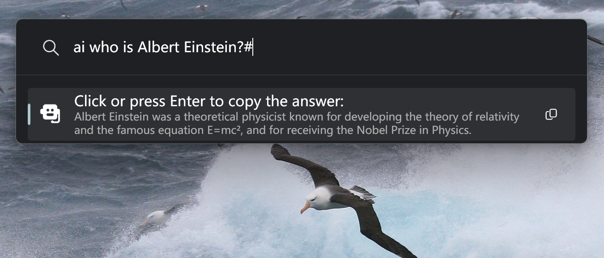

# ChatOpenAI
A plugin for PowerToys Run that allows you to chat with your OpenAI API.



## Features
For the scenarios of PowerToys Run, you may want an answer as concise as possible. If you agree to it, ChatOpenAI is the plugin you need!

You can:
- Use your own OpenAI API or OpenAI compatible API.
- Specify the model you want.
- Get your answer after you type an ending character to save a few tokens for you (you can disable it if you do not like it).
- Click or press Enter to copy the answer.

## Usage
1. Set your OpenAI API baseURL, API key and model name.


2. Ask your question in PowerToys Run and end your question with and end character (pound by default, you can set it also).
3. If you want to copy the answer, click it or press Enter key.

## Installation
### Manual Installation
1. Download the latest release of the ChatOpenAI from the releases page.
2. Extract the zip file's contents to your PowerToys modules directory for the user (`%LOCALAPPDATA%\Microsoft\PowerToys\PowerToys Run\Plugins`).
3. Restart PowerToys.

### Use [ptr](https://github.com/8LWXpg/ptr)
```shell
ptr add ChatOpenAI Bennett-Yang/PowerToysRun_ChatOpenAI
```


## Acknowledgments
Thank [hlaueriksson](https://github.com/hlaueriksson) for the blog [Creating custom PowerToys Run plugins](https://conductofcode.io/post/creating-custom-powertoys-run-plugins/) which guides me to finish the plugin!